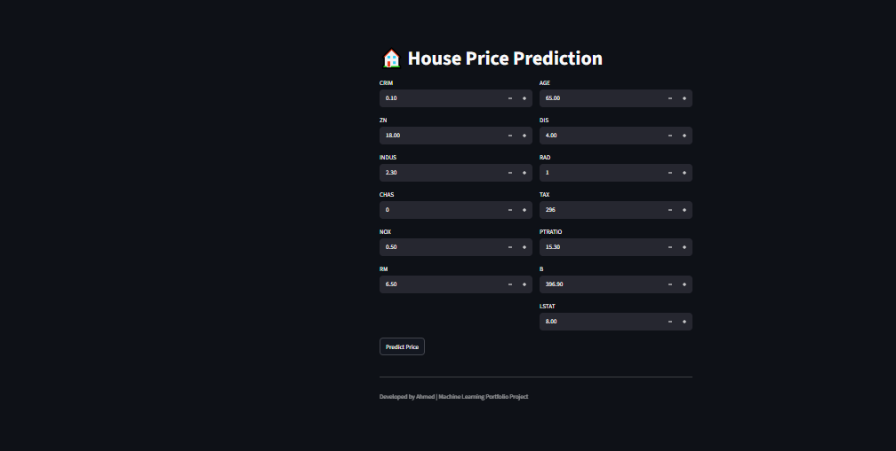
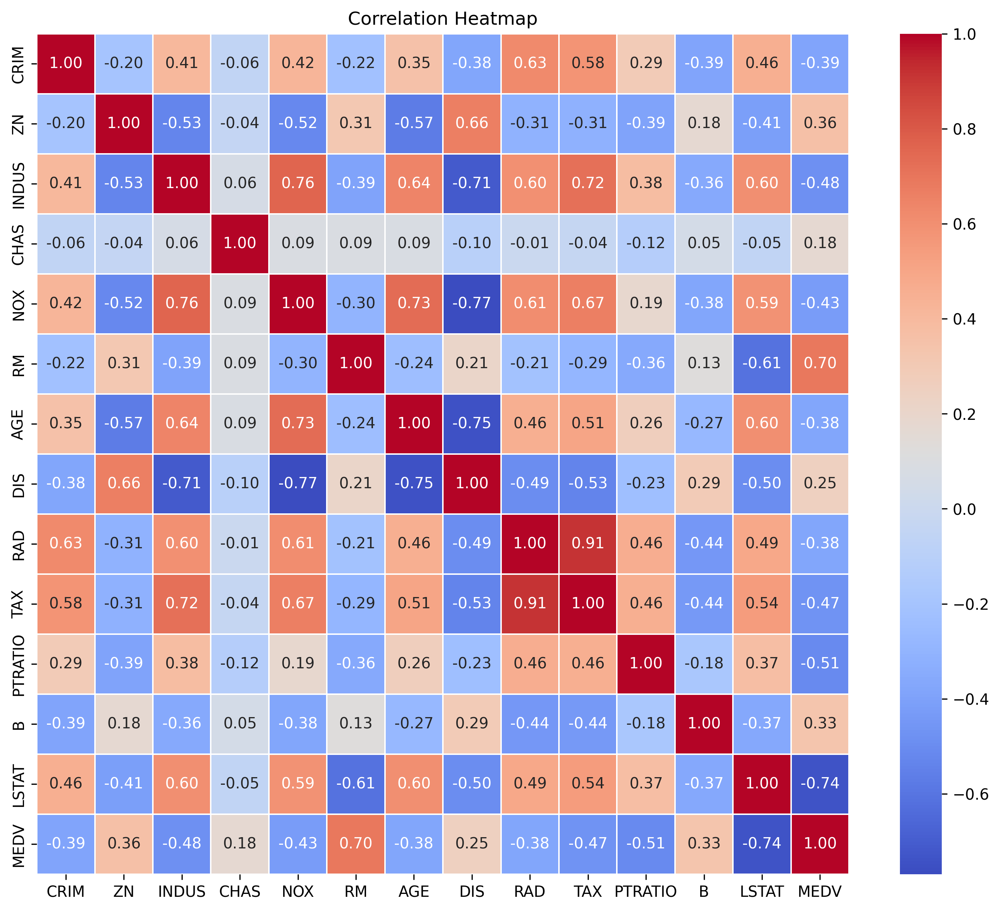
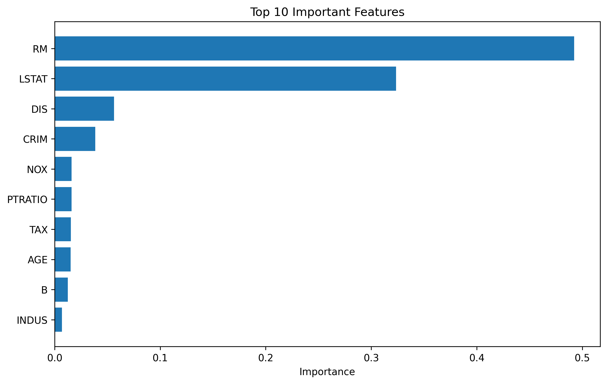

# 🏠 House Price Prediction using Machine Learning

## 📌 Project Overview

This project predicts house prices using Machine Learning. It includes data preprocessing, exploratory data analysis (EDA), model training, evaluation, hyperparameter tuning, and a Streamlit web application for predictions.

---

## 📂 Dataset

- Boston Housing Dataset

---

## 🚀 Technologies Used

- Python
- Pandas
- NumPy
- Matplotlib
- Seaborn
- Scikit-learn
- Joblib
- Streamlit

---

## 📊 Machine Learning Workflow

- Data Cleaning
- Exploratory Data Analysis (EDA)
- Feature Engineering
- Train-Test Split
- Model Training
- Hyperparameter Tuning
- Model Evaluation
- Model Saving
- Streamlit Deployment

---

## 🤖 Models Used

- Linear Regression
- Random Forest Regressor

---

## 📈 Evaluation Metrics

- Mean Absolute Error (MAE)
- Root Mean Squared Error (RMSE)
- R² Score

---

## 🖥️ Run the Project

Install dependencies:

```bash
pip install -r requirements.txt
```

Run the application:

```bash
streamlit run app.py
```

---

## 📁 Project Structure

```text
House-Price-Prediction/
│
├── app.py
├── HousePricePrediction.ipynb
├── house_price_model.pkl
├── requirements.txt
├── README.md
└── images/
```

---
## Application



## Prediction Example


## Correlation Heatmap



## Feature Importance

## Application


## 👨‍💻 Author

Ahmed
